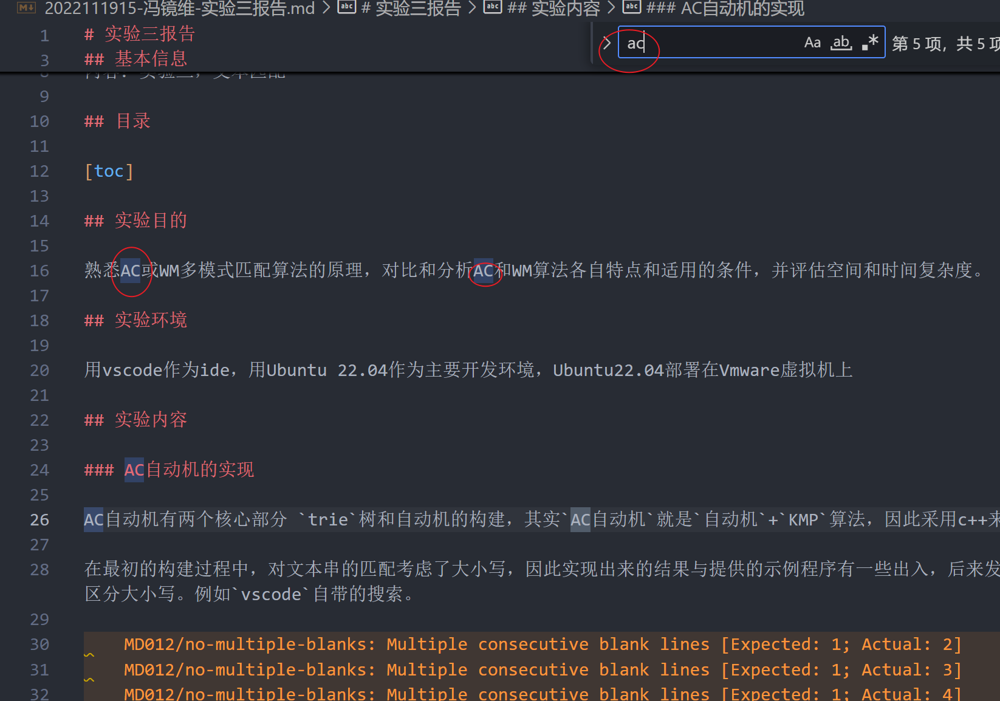
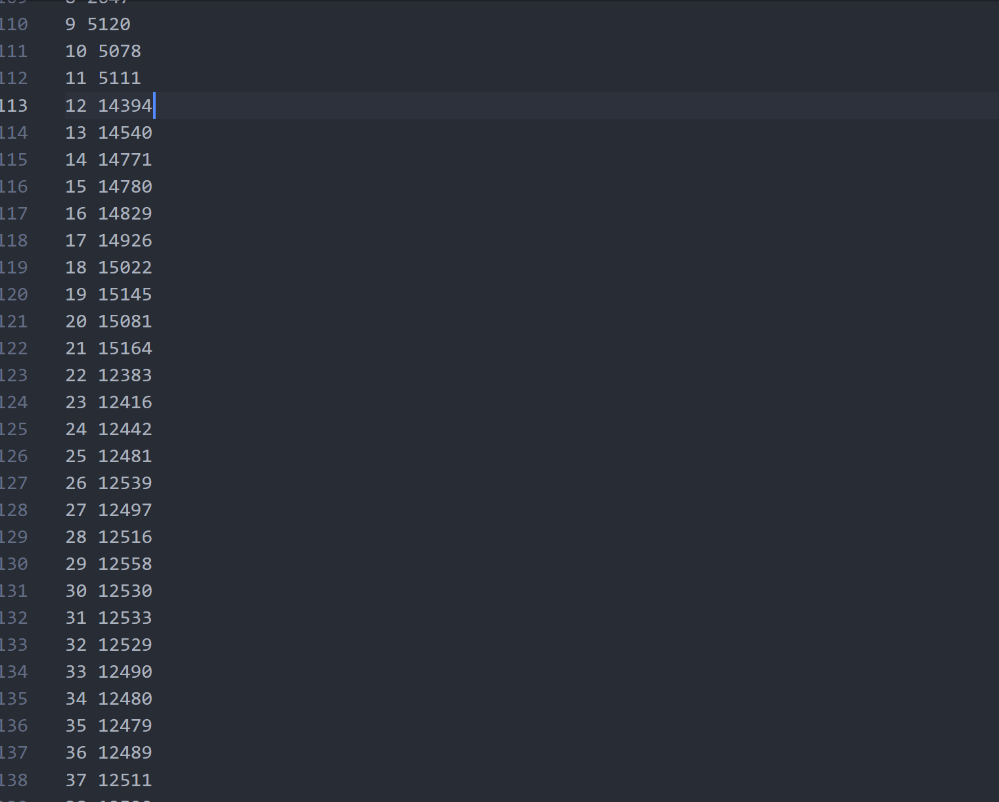
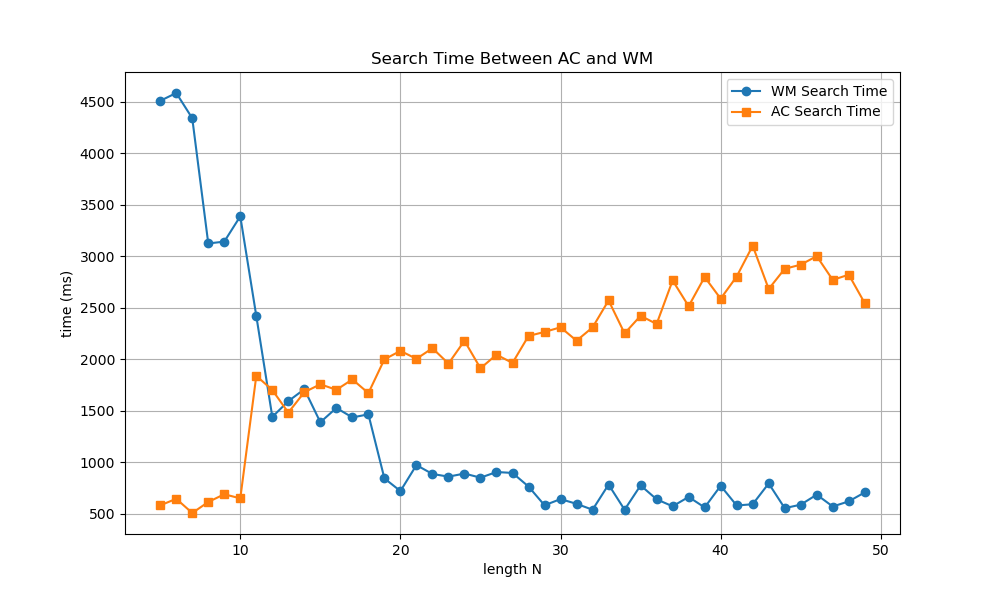

# 实验三报告

## 基本信息

姓名:
班级：
学号：
内容：实验三，文本匹配

## 目录

[toc]

## 实验目的

熟悉AC或WM多模式匹配算法的原理，对比和分析AC和WM算法各自特点和适用的条件，并评估空间和时间复杂度。

## 实验环境

用vscode作为ide，用Ubuntu 22.04作为主要开发环境，Ubuntu22.04部署在Vmware虚拟机上

## 实验内容

### AC自动机的实现

AC自动机有两个核心部分 `trie`树和自动机的构建，其实`AC自动机`就是`自动机`+`KMP`算法，因此采用c++来编写。

在最初的构建过程中，对文本串的匹配考虑了大小写，因此实现出来的结果与提供的示例程序有一些出入，后来发现模式匹配不应当区分大小写。例如`vscode`自带的搜索。



将`ac`自动机封装为一个模板类

```c++
template<typename T>
class AhoCorasick {
    AhoCorasick() : root(std::make_unique<Node>()) {}
}
```

然后构建`trie`树的数据结构

```c++
struct Node {
        //存储指向子节点的指针，每个子节点对应一个字母
        std::unique_ptr<Node> children[ALPHABET_SIZE];
        Node* fail;  // 匹配失败时跳转到另一个节点
        bool is_end_of_word; // 是否是某个模式串的结尾
        std::string pattern; // 存储与当前节点关联的字符串

        Node() : fail(nullptr), is_end_of_word(false) {} //constructor
    };
```

这里面每一个节点的孩子节点，用`unique_ptr`来实现，这个是`c++`提供的库，在不需要的时候可以自动释放，可以有效减小内存占用（但是会大大增加运行时间）

然后开始构造`trie`树

```c++
void insert_pattern(const std::string& pattern) {
        Node* current = root.get(); // from the root node 
        for (char ch : pattern) { // 遍历每一个字符 
        // 这里面用static_cast要更安全 static_cast可以用来做基本数据之间的转换
        // 也可以用来做指针类型之间的转换
        // 还可以做downcast 和 upcast
            if (!current->children[static_cast<unsigned char>(ch)]) {
                current->children[static_cast<unsigned char>(ch)] = std::make_unique<Node>();
            }
            // 有就利用原来的 没有就开一个新的节点
            current = current->children[static_cast<unsigned char>(ch)].get();
        }
        current->is_end_of_word = true;
        current->pattern = pattern;
    }
```

然后用`stl-queue`来构造`fail`指针，其实质与`kmp`类似

```c++
void build_fail_pointers() {
        // 用来做bfs
        std::queue<Node*> q;
        for (int i = 0; i < ALPHABET_SIZE; ++i) {
            if (root->children[i]) {
                root->children[i]->fail = root.get();
                q.push(root->children[i].get());
            }
        }

        while (!q.empty()) {
            Node* current = q.front();
            q.pop();
        // 裤裤就是往下遍历
            for (int i = 0; i < ALPHABET_SIZE; ++i) {
                if (current->children[i]) {
                    Node* fail_node = current->fail;
                    while (fail_node && !fail_node->children[i]) {
                        fail_node = fail_node->fail;
                    }
                    if (fail_node) {
                        current->children[i]->fail = fail_node->children[i].get();
                    } else {
                        current->children[i]->fail = root.get();
                    }
                    q.push(current->children[i].get());
                }
            }
        }
    }
```

使用` BFS `遍历每个节点的子节点：

对于每个子节点，找到其失败指针 `fail_node`。
如果 `fail_node` 存在且有对应的子节点，则将当前子节点的失败指针指向` fail_node` 的对应子节点。
如果 `fail_node` 不存在，则将当前子节点的失败指针指向根节点。
将当前子节点加入队列，继续处理其子节点。

然后是最后的搜索方法

```c++
int search_text(const std::string& text) {
        Node* current = root.get();
        int match_count = 0;

        for (char ch : text) {
            while (current && !current->children[static_cast<unsigned char>(ch)]) {
                current = current->fail;
            }
            if (!current) {
                current = root.get();
            } else {
                current = current->children[static_cast<unsigned char>(ch)].get();
            }

            Node* temp = current;
            while (temp != root.get() && temp->is_end_of_word) {
                std::cout << "找到模式串: " << temp->pattern << std::endl;
                match_count++;
                temp = temp->fail;
            }
        }

        return match_count;
    }
```

最后是`main`函数

```c++
int main() {
    AhoCorasick<char> ac; // 单字符作为template的ac
    std::string pattern;
    std::ifstream pattern_file;
    std::ifstream text_file;
    std::string text_data;
    int match_count;
    clock_t start_time_p, end_time_p, start_time_t, end_time_t;
    int p = 0;

    while (p != 1 && p != 2 && p != 3) {
        std::cout << "请输入模式文件序号(1~3)：\n";
        std::cin >> p;
        if (p == 1) {
            pattern_file.open("pattern1w.txt");
            if (!pattern_file) {
                std::cerr << "无法打开 'pattern1w.txt'\n";
                return 1;
            }
        } else if (p == 2) {
            pattern_file.open("pattern2w.txt");
            if (!pattern_file) {
                std::cerr << "无法打开 'pattern2w.txt'\n";
                return 1;
            }
        } else if (p == 3) {
            pattern_file.open("pattern3w.txt");
            if (!pattern_file) {
                std::cerr << "无法打开 'pattern3w.txt'\n";
                return 1;
            }
        }
    }

    start_time_p = clock(); // 记录一下开始时间
    while (std::getline(pattern_file, pattern)) { // 一行一行读取
        pattern.erase(pattern.find_last_not_of("\r\n") + 1);
        ac.insert_pattern(pattern);
    }
    ac.build_fail_pointers();
    end_time_p = clock();
    pattern_file.close();

    text_file.open("text.txt");
    if (!text_file) {
        std::cerr << "无法打开 'text.txt'\n";
        return 1;
    }

    text_data.assign((std::istreambuf_iterator<char>(text_file)), std::istreambuf_iterator<char>());
    text_file.close();

    start_time_t = clock();
    match_count = ac.search_text(text_data);
    end_time_t = clock();

    if (p == 1) {
        std::cout << "初始化pattern1w耗时: " << static_cast<double>(end_time_p - start_time_p) / CLOCKS_PER_SEC << " 秒\n";
        std::cout << "搜索 pattern1w 的时间：" << static_cast<double>(end_time_t - start_time_t) / CLOCKS_PER_SEC << " 秒\n";
    } else if (p == 2) {
        std::cout << "初始化pattern2w耗时: " << static_cast<double>(end_time_p - start_time_p) / CLOCKS_PER_SEC << " 秒\n";
        std::cout << "搜索 pattern2w 的时间：" << static_cast<double>(end_time_t - start_time_t) / CLOCKS_PER_SEC << " 秒\n";
    } else if (p == 3) {
        std::cout << "初始化pattern3w耗时: " << static_cast<double>(end_time_p - start_time_p) / CLOCKS_PER_SEC << " 秒\n";
        std::cout << "搜索 pattern3w 的时间：" << static_cast<double>(end_time_t - start_time_t) / CLOCKS_PER_SEC << " 秒\n";
    }

    std::cout << "找到的总匹配数: " << match_count << std::endl;

    return 0;
}
```

### WM算法的实现

wm算法的核心是哈希函数的构建。

移位表（Shift Table）：用于在文本中跳过不可能匹配的字符，提高搜索效率。

哈希表（Hash Table）：将模式串按照其后缀的哈希值分组，便于快速查找可能匹配的模式。

前缀表（Prefix Table）：存储模式串前缀的哈希值，用于快速验证潜在匹配。

```c++
#include <iostream>
#include <vector>
#include <string>
#include <cstring>
#include <cctype>
#include <algorithm>


typedef unsigned short HASH_TYPE;

const int HASHTABLESIZE = 65536;   // 哈希表大小
const int SHIFTTABLESIZE = 65536;  // 移位表大小

class WuManber {
private:
    struct Pattern {
        std::string pat;    // 模式串
        size_t length;      // 模式串长度

        Pattern(const std::string& p) : pat(p), length(p.length()) {}
    };

    int msNumPatterns;                   // 模式串数量
    size_t msSmallest;                   // 最短模式串长度
    std::vector<Pattern> patterns;       // 模式串列表
    std::vector<unsigned short> msNumArray;  // 每个组中模式串的数量
    std::vector<HASH_TYPE> msHash;           // 模式串组的哈希表
    std::vector<HASH_TYPE> msPrefix;         // 模式串的前缀哈希值
    std::vector<unsigned char> msShift;      // 坏字符规则的移位表

    // 计算两个字符的16位哈希值
    static unsigned short HASH16(const unsigned char* T) {
        return static_cast<unsigned short>(((T[0] << 8) | T[1]));
    }

    // 根据模式串末尾两个字符的哈希值对模式串进行排序
    void sortPatterns() {
        size_t m = msSmallest;
        std::sort(patterns.begin(), patterns.end(), [m](const Pattern& a, const Pattern& b) {
            return HASH16(reinterpret_cast<const unsigned char*>(a.pat.c_str() + m - 2)) <
                   HASH16(reinterpret_cast<const unsigned char*>(b.pat.c_str() + m - 2));
        });
    }

    // 准备模式串组的哈希表
    void prepHashedPatternGroups() {
        msHash.resize(HASHTABLESIZE, static_cast<HASH_TYPE>(-1));
        msNumArray.resize(msNumPatterns, 0);

        size_t m = msSmallest;
        for (size_t i = 0; i < patterns.size(); ) {
            unsigned short hindex = HASH16(reinterpret_cast<const unsigned char*>(patterns[i].pat.c_str() + m - 2));
            size_t sindex = i;
            msHash[hindex] = static_cast<HASH_TYPE>(i);
            size_t ningroup = 1;

            while (++i < patterns.size() &&
                   hindex == HASH16(reinterpret_cast<const unsigned char*>(patterns[i].pat.c_str() + m - 2))) {
                ningroup++;
            }
            msNumArray[sindex] = static_cast<unsigned short>(ningroup);
        }
    }

    // 准备坏字符规则的移位表
    void prepShiftTable() {
        size_t m = msSmallest;
        msShift.resize(SHIFTTABLESIZE, static_cast<unsigned char>(m - 2 + 1));

        for (const auto& pattern : patterns) {
            for (size_t k = 0; k < m - 1; k++) {
                unsigned short shift = static_cast<unsigned short>(m - 2 - k);
                unsigned short cindex = (pattern.pat[k] << 8) | pattern.pat[k + 1];

                if (shift < msShift[cindex]) {
                    msShift[cindex] = static_cast<unsigned char>(shift);
                }
            }
        }
    }

    // 准备模式串的前缀哈希表
    void prepPrefixTable() {
        msPrefix.resize(msNumPatterns);

        for (size_t i = 0; i < patterns.size(); i++) {
            msPrefix[i] = HASH16(reinterpret_cast<const unsigned char*>(patterns[i].pat.c_str()));
        }
    }

    // 当找到可能的匹配时，进行组匹配
    void groupMatch(size_t lindex, const std::string& text, size_t pos) {
        size_t m = msSmallest;
        size_t index = lindex;
        unsigned short text_prefix = HASH16(reinterpret_cast<const unsigned char*>(text.c_str() + pos));

        size_t ningroup = msNumArray[lindex];

        for (size_t i = 0; i < ningroup; i++, index++) {
            if (msPrefix[index] != text_prefix) {
                continue;
            }

            const std::string& pat = patterns[index].pat;
            if (text.compare(pos, pat.length(), pat) == 0) {
                // 匹配成功，输出匹配信息
                std::cout << "匹配到模式串 \"" << pat << "\" 在位置 " << pos << std::endl;
            }
        }
    }

public:
    WuManber() : msNumPatterns(0), msSmallest(SIZE_MAX) {}

    ~WuManber() {}

    // 添加模式串到模式串集
    void addPattern(const std::string& pattern) {
        patterns.emplace_back(pattern);
        msNumPatterns++;
        if (pattern.length() < msSmallest) {
            msSmallest = pattern.length();
        }
    }

    // 准备模式串（预处理）
    void prepPatterns() {
        sortPatterns();
        prepHashedPatternGroups();
        prepShiftTable();
        prepPrefixTable();
    }

    // 在给定的文本中搜索模式串
    void search(const std::string& text) {
        size_t n = text.length();
        size_t m = msSmallest;

        if (n < m) {
            // 文本长度小于最短模式串，无法匹配
            return;
        }

        size_t pos = 0;
        while (pos <= n - m) {
            unsigned short cindex = (text[pos + m - 2] << 8) | text[pos + m - 1];
            unsigned char tshift = msShift[cindex];

            if (tshift == 0) {
                unsigned short hindex = HASH16(reinterpret_cast<const unsigned char*>(text.c_str() + pos + m - 2));
                size_t lindex = msHash[hindex];

                if (lindex != static_cast<HASH_TYPE>(-1)) {
                    groupMatch(lindex, text, pos);
                }
                pos++;
            } else {
                pos += tshift;
            }
        }
    }
};

int main() {
    WuManber wm;
    int n;
    std::string pattern, text;

    std::cout << "请输入模式串的数量：" << std::endl;
    std::cin >> n;

    std::cout << "请输入模式串：" << std::endl;
    for (int i = 0; i < n; ++i) {
        std::cin >> pattern;
        wm.addPattern(pattern);
    }

    wm.prepPatterns();

    std::cout << "请输入要搜索的文本：" << std::endl;
    std::cin >> text;

    wm.search(text);

    return 0;
}
```

此外，实验中要求`WM`算法和`AC`算法混合，只需要在特定时候调用接口即可。

## 实验结果和分析

### AC自动机对不同模式集匹配的结果

```bash
zephyr@zephyr-virtual-machine:/mnt/hgfs/字符串匹配/src/test$ ./StringMatch pattern1w.txt text.txt 1
[AC] Initialization_time=1703ms
进程 114348 的虚拟内存使用 (VSize): 191.50 MB
[AC] Search_time=2141ms Hit_num=267377
zephyr@zephyr-virtual-machine:/mnt/hgfs/字符串匹配/src/test$ ./StringMatch pattern2w.txt text.txt 1
[AC] Initialization_time=3578ms
进程 114394 的虚拟内存使用 (VSize): 355.48 MB
[AC] Search_time=2139ms Hit_num=451305
zephyr@zephyr-virtual-machine:/mnt/hgfs/字符串匹配/src/test$ ./StringMatch pattern3w.txt text.txt 1
[AC] Initialization_time=6903ms
进程 114475 的虚拟内存使用 (VSize): 722.21 MB
[AC] Search_time=3110ms Hit_num=467021
```

分析发现，AC自动机占用内存随着模式集增加而飞速增加，且占用极大。这是因为在构建`trie`树的时候，占用空间很大，但时间增长还可以。

### WM算法对不同模式集匹配的结果

```bash
zephyr@zephyr-virtual-machine:/mnt/hgfs/字符串匹配/src/test$ ./StringMatch pattern1w.txt text.txt 2
[WM] Initialization_time=303ms
进程 114573 的虚拟内存使用 (VSize): 4.30 MB
[WM] Search_time=2432ms Hit_num=267377
zephyr@zephyr-virtual-machine:/mnt/hgfs/字符串匹配/src/test$ ./StringMatch pattern2w.txt text.txt 2
[WM] Initialization_time=2054ms
进程 114613 的虚拟内存使用 (VSize): 5.61 MB
[WM] Search_time=3189ms Hit_num=451305
zephyr@zephyr-virtual-machine:/mnt/hgfs/字符串匹配/src/test$ ./StringMatch pattern3w.txt text.txt 2
[WM] Initialization_time=5608ms
进程 114660 的虚拟内存使用 (VSize): 7.15 MB
[WM] Search_time=4727ms Hit_num=467021

```

### 结果分析

我们选择了不同规模的模式集，分别用`AC`和`WM`进行匹配

可看到`WM`算法时间要远远小于`AC`,同时内存占用也很小，这是因为`WM`算法主要是哈希表构建过程中需要占用内存。

**此外，WM算法对测试串的预处理时间较长，且测试串越多、越长，预处理时间越大，这与哈希表构建有关，但其匹配过程中效率很高**

#### AC自动机算法时间复杂度

我们定义 $|s_i|$是模式串长度，$|S|$是文本串长度，$|\Sigma|$是字符集大小，在使用`trie`树的前提下，时间复杂度是$$|O(\Sigma|s_i| + n|\Sigma| + |S|)$$,其中$n$是AC自动机中节点数目，时间复杂度是$O(\Sigma|s_i| + |S|)$

#### WM算法的时间复杂度

WM算法的时间复杂度是$O(\frac{Bn}{Km})$

### AC算法与WM算法的比较

首先根据上面的分析，我们可以得出结论**WM使用于大规模的模式串集合且模式串集合中最小长度较大的场景**。

我们通过程序选择`text.txt`中测试字符串的最大长度，然后分析运行时间。

```bash
zephyr@zephyr-virtual-machine:/mnt/hgfs/字符串匹配/src/test$ ./StringMatch pattern3w.txt text.txt 3 10
[WM] Initialization_time=5319ms
进程 113919 的虚拟内存使用 (VSize): 7.15 MB
[WM] Search_time=3179ms Hit_num=466817
[AC] Initialization_time=0ms
进程 113919 的虚拟内存使用 (VSize): 6.46 MB
[AC] Search_time=837ms Hit_num=204
zephyr@zephyr-virtual-machine:/mnt/hgfs/字符串匹配/src/test$ ./StringMatch pattern3w.txt text.txt 3 20
[WM] Initialization_time=896ms
进程 114008 的虚拟内存使用 (VSize): 5.86 MB
[WM] Search_time=998ms Hit_num=34598
[AC] Initialization_time=1786ms
进程 114008 的虚拟内存使用 (VSize): 212.04 MB
[AC] Search_time=2241ms Hit_num=432423
zephyr@zephyr-virtual-machine:/mnt/hgfs/字符串匹配/src/test$ ./StringMatch pattern3w.txt text.txt 3 30
[WM] Initialization_time=341ms
进程 114067 的虚拟内存使用 (VSize): 5.36 MB
[WM] Search_time=518ms Hit_num=15716
[AC] Initialization_time=3860ms
进程 114067 的虚拟内存使用 (VSize): 356.65 MB
[AC] Search_time=2185ms Hit_num=451305
zephyr@zephyr-virtual-machine:/mnt/hgfs/字符串匹配/src/test$ ./StringMatch pattern3w.txt text.txt 3 40
[WM] Initialization_time=1ms
进程 114143 的虚拟内存使用 (VSize): 4.35 MB
[WM] Search_time=459ms Hit_num=0
[AC] Initialization_time=6992ms
进程 114143 的虚拟内存使用 (VSize): 722.13 MB
[AC] Search_time=2541ms Hit_num=467021
zephyr@zephyr-virtual-machine:/mnt/hgfs/字符串匹配/src/test$ ./StringMatch pattern3w.txt text.txt 3 50
[WM] Initialization_time=0ms
进程 114213 的虚拟内存使用 (VSize): 4.35 MB
[WM] Search_time=673ms Hit_num=0
[AC] Initialization_time=7072ms
进程 114213 的虚拟内存使用 (VSize): 722.13 MB
[AC] Search_time=2521ms Hit_num=467021
```

可以看到，当测试字符串比较小的时候，`wm`的算法要将近`3179ms`，几千毫秒，而`AC`算法仅需要`837ms`左右，因此在测试串比较短的时候，`ac`算法比较好，但是当测试串长度变长后，wm算法只需要`673ms`，而且增长很缓慢，同时ac算法的搜索时间为`2521ms`左右。

### 将ac算法和wm算法融合

我们通过前面的实验知道，ac算法在测试串长度短的时候，消耗时间远远低于wm算法，而当测试串长度变长之后，wm算法明显占据优势，因此我们可以将二者融合，当测试串小于一个阈值的时候，我们使用ac算法，当测试串长度大于一个阈值之后，我们使用wm算法。

因此现在的目的是求出一个阈值。

对`text.txt`文件的测试串长度进行分析，写出如下bash脚本

```bash
awk '{ print length, $0 }' text.txt | awk '{ count[$1]++ } END { for (len in count) print len, count[len] }'
```





发现测试串长度主要集中在5-50左右，这样我们先简单在这个范围内尝试，看看二者是否会产生交集。

编写一段简单的python代码，反复运行`./StringMatch`程序，然后将最后一个参数（也就是测试串最大长度）不断从`5`迭代到`51`，然后提取出两个算法的时间。

```python
import subprocess
import re
import matplotlib.pyplot as plt

# 定义存储N值、WM时间和AC时间的列表
N_values = range(5, 50)  # N从5到50
wm_times = []
ac_times = []

# 正则表达式模式，用于提取时间
wm_pattern = r'\[WM\] Search_time=(\d+)ms'
ac_pattern = r'\[AC\] Search_time=(\d+)ms'

memory_pattern = r'进程 \d+ 的虚拟内存使用 \(VSize\): (\d+\.\d+) MB'

result_string  = ""

for N in N_values:
    # 构建命令
    command = ['./StringMatch', 'pattern3w.txt', 'text.txt', '3', str(N)]
    try:
        # 执行命令并捕获输出
        result = subprocess.run(command, stdout=subprocess.PIPE, stderr=subprocess.PIPE, text=True)
        output = result.stdout + result.stderr

        result_string += output + "\r\n"

        # 提取WM算法的搜索时间
        wm_search_time = re.search(wm_pattern, output)
        if wm_search_time:
            wm_time = int(wm_search_time.group(1))
            wm_times.append(wm_time)
            print(f"N={N}时候，wm的算法的搜索时间是{wm_time}")
        else:
            wm_times.append(None)
            print(f"N={N}时未找到WM算法的搜索时间。")

        # 提取AC算法的搜索时间
        ac_search_time = re.search(ac_pattern, output)
        if ac_search_time:
            ac_time = int(ac_search_time.group(1))
            ac_times.append(ac_time)
            print(f"N={N}时候，ac的算法的搜索时间是{ac_time}")
        else:
            ac_times.append(None)
            print(f"N={N}时未找到AC算法的搜索时间。")

    except Exception as e:
        wm_times.append(None)
        ac_times.append(None)
        print(f"N={N}时执行命令出错：{e}")


# 绘制图形
plt.figure(figsize=(10, 6))
plt.plot(N_values, wm_times, label='WM Search Time', marker='o')
plt.plot(N_values, ac_times, label='AC Search Time', marker='s')
plt.xlabel('length N')
plt.ylabel('time (ms)')
plt.title('Search Time Between AC and WM')
plt.legend()
plt.grid(True)
plt.savefig('./fig.png')
with open('./result.txt') as f:
    f.write(result_string)
```

得到如下结果



因此阈值应当是`n=15`或者`n=16`。

当测试串长度小于16的时候，使用`ac`自动机时间更好，当测试串长度大于`16`后，应当使用`wm`算法。

## 实验总结

首先实现了ac和wm算法

然后在不同数据规模下分析，并且用python反复调用的方法比较精确的求解出了临界值，同时用一张图非常直观的展示出来。